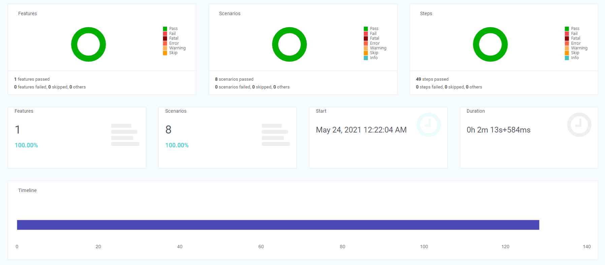
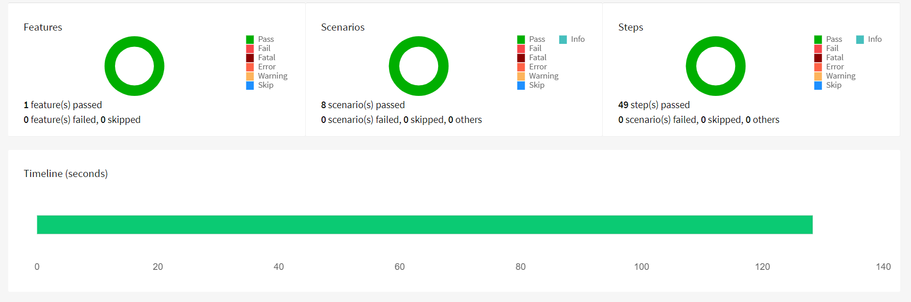
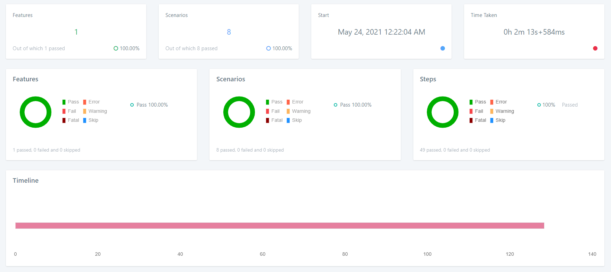

User Registration in Miro
---

Java-based test automation framework built on top Selenium WebDriver to initialise the Chrome Browser for the User registration in Miro.

### Frameworks & tools

Java 8,

Selenium WebDriver,

JUnit,

Cucumber (BDD) / Gherkin,

Maven

### Steps to run

 1) Run as Maven Application in command prompt
    
        mvn clean verify
    
 2) Run in Elicpse
    
        com.miro.runner.SignupRunner

### Steps to test the application

 1) Application URL: https://miro.com/signup/
    
 2) Enter the new user name/work mail to test the first time user registration in the feature file "01_new_user_signup.feature".
    
 3) Separate selenium chromedriver is not required, as framework handle the application to run by setup the ChromeDriver via the ChromeDriverManager.

### Application Test Reports

 1) Spark Report under test-output/Selenix-Spark
   
    

 2) HTML Report under test-output/HtmlReport
    
    
    
 3) Logger Report under test-output/Selenix-Logger

    
   